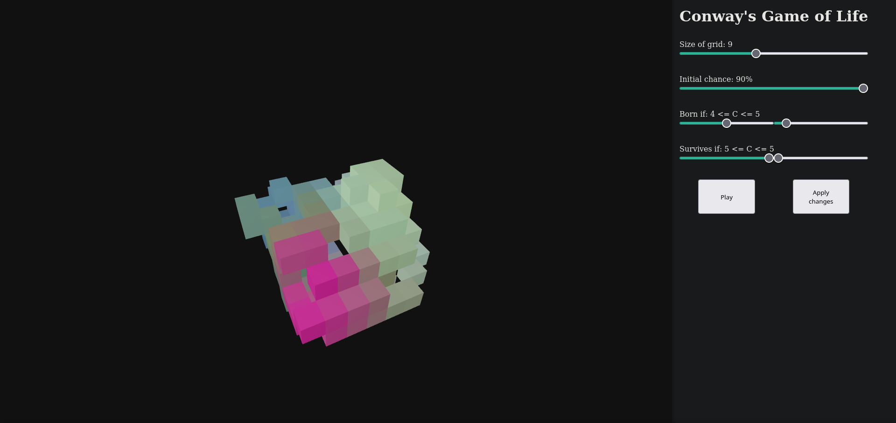

# Game of Life 3D
> English not my first language

React JS + Tree JS app to visualize a 3D version of Conway's Game of Life

## Table of contents
- [Introduction](#introduction)
- [Technologies](#technologies)
- [Illustrations](#illustrations)
- [To-Do](#to-do)

## Introduction
This project is to practice with Tree JS for 3D elements (Since 3D with only CSS looks far away from my capabilities) by showing an animation for Conway's Game Of Life.

In 2D, the default would be B3/S23 (\[Cells are\] born if surrounded by 3 cells, survive if surrounded by 2 or 3, die or remain dead otherwise), but for this 3D version it will be B45/S55 (Considering surrounding cells as "C", a cell will be born if *4 <= C <= 5*, survives if *5 <= C <= 5*, and dies or remains dead otherwise).

For this project, each cell will be born with a random color. If a cell will be born, it gets the average of the colrs of the cells near it (That means, it's new color will be the average of the R, G and B values of the living cells around it).

The limits of the cube (Represented by "Size of the grid", starting at 5 x 5 x 5) do not wrap around, so the cells on the edge do not interact with the cells on the other edge of the cube.

## Technologies
- Node JS v16.2.0
- [Three JS](https://www.npmjs.com/package/@react-three/fiber) v7.0.1
- [Drei](https://www.npmjs.com/package/@react-three/drei) v6.0.3 (Adds controls for the 3D environment generated by Three JS)

## Illustrations

## To-Do